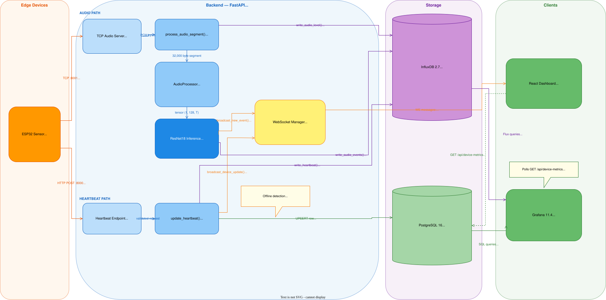

# Hospital Sound Monitor

Real-time audio event monitoring system for hospital environments. ESP32 sensors stream raw PCM audio over TCP to a FastAPI backend that runs ML inference using a ResNet18 classifier. Detected events and continuous audio levels are written to InfluxDB and device status to PostgreSQL. A React dashboard shows each sensor's live dB level and online/offline state. Grafana provides all historical analytics.

---

## Table of Contents

1. [Architecture Overview](#architecture-overview)
2. [System Data Flow](#system-data-flow)
3. [Services at a Glance](#services-at-a-glance)
4. [Quick Start](#quick-start)
5. [Configuration Reference](#configuration-reference)
6. [Backend](#backend)
   - [Authentication](#authentication)
   - [Audio Ingest — TCP Server](#audio-ingest--tcp-server)
   - [ML Inference Engine](#ml-inference-engine)
   - [Device Metrics](#device-metrics)
   - [Events Service](#events-service)
   - [WebSocket](#websocket)
   - [Sensors Service](#sensors-service)
   - [Database Layer](#database-layer)
7. [Frontend](#frontend)
   - [Routing and Auth](#routing-and-auth)
   - [Dashboard Page](#dashboard-page)
   - [SensorCard Component](#sensorcard-component)
   - [Data Hooks](#data-hooks)
   - [Theme System](#theme-system)
8. [ML Model](#ml-model)
9. [Grafana Dashboards](#grafana-dashboards)
10. [ESP32 Device Integration](#esp32-device-integration)
11. [Simulator](#simulator)
12. [Development](#development)
13. [API Reference](#api-reference)

---

## Architecture Overview

```
┌─────────────────────────────────────────────────────────────────┐
│  Edge Devices                                                   │
│  ESP32 + INMP441 microphone                                     │
│                                                                 │
│   TCP :8001 ──── raw PCM audio stream ──────────────────────┐   │
│   HTTP :8000 ─── periodic heartbeat (battery, signal, fw) ──┤   │
└─────────────────────────────────────────────────────────────┼───┘
                                                              │
                         ┌────────────────────────────────────▼────┐
                         │  Backend  (FastAPI, port 8000)          │
                         │                                         │
                         │  TCP Server ──► ML Inference            │
                         │                     │                   │
                         │              detected events            │
                         │              audio levels               │
                         │                     │                   │
                         │           ┌─────────▼──────────┐        │
                         │           │  InfluxDB :8086    │        │
                         │           │  audio_events      │        │
                         │           │  audio_level       │        │
                         │           │  device_heartbeat  │        │
                         │           └────────────────────┘        │
                         │                                         │
                         │  Heartbeat ──► PostgreSQL :5432         │
                         │               device_metrics table      │
                         │                                         │
                         │  WebSocket /ws/events ◄─────────────────┤
                         └─────────────────────────────┬───────────┘
                                                       │
              ┌────────────────────────────────────────┼─────────────┐
              │                                        │             │
   ┌──────────▼───────────┐              ┌─────────────▼───────────┐ │
   │  React Frontend      │              │  Grafana  :3001         │ │
   │  :3000               │              │                         │ │
   │                      │              │  InfluxDB datasource    │ │
   │  Live sensor grid    │              │  PostgreSQL datasource  │ │
   │  dB levels           │              │                         │ │
   │  Online/offline      │              │  4 dashboards           │ │
   └──────────────────────┘              └─────────────────────────┘ │
```

---

## System Data Flow

### Audio Processing Path (every ~1 second per connected sensor)

```
ESP32 streams 32,000 bytes of raw PCM (16-bit, 16kHz, mono)
    │
    ▼
TCPAudioServer buffers incoming bytes
    │  (accumulates until segment_bytes threshold is reached)
    ▼
process_audio_segment()
    ├─► AudioProcessor.preprocess()
    │       pcm_bytes → waveform tensor
    │       compute RMS loudness in dBFS
    │       apply MelSpectrogram transform (128 mels, FFT=1024, hop=512)
    │       convert to dB scale (AmplitudeToDB, top_db=80)
    │       → shape: (1, 128, time_steps)
    │
    ├─► SoundInference.predict()  [ResNet18 forward pass]
    │       sigmoid per class → probabilities
    │       threshold (default 0.5) → detected_events list
    │
    ├─► write_audio_level()       → InfluxDB measurement: audio_level
    │       always written regardless of detections
    │
    ├─► write_audio_events()      → InfluxDB measurement: audio_events
    │       one point per detected event (multi-label capable)
    │
    └─► broadcast_new_event()     → WebSocket → all connected dashboard clients
            one message per detected event
```

### Heartbeat Path (every ~30 seconds per sensor)

```
ESP32 HTTP POST /api/device-metrics/heartbeat
    │
    ▼
update_heartbeat()
    ├─► upsert device_metrics row in PostgreSQL
    │       is_online = True, last_heartbeat = now
    │       battery_percent, signal_strength_dbm, bandwidth_kbps, firmware_version
    │
    ├─► broadcast_device_update() → WebSocket → all connected dashboard clients
    │       immediate live update of sensor card (no 30s poll needed)
    │
    └─► write_heartbeat()         → InfluxDB measurement: device_heartbeat
            time-series record for Grafana trend charts
```

### Full Data Pipeline SVG


### Online/Offline Detection

A device is marked offline if `last_heartbeat` is older than 5 minutes (`ONLINE_THRESHOLD_MINUTES = 5`). This check runs whenever `GET /api/device-metrics` is called (polling every 30s from the frontend). If a device goes offline mid-session, the frontend will reflect it on the next 30s poll — the WebSocket path only pushes updates when a heartbeat arrives, not when one is absent.

---

## Services at a Glance

| Service | Image / Build | Port(s) | Purpose |
|---------|--------------|---------|---------|
| `postgres` | postgres:16-alpine | 5432 | Device state (online/offline, battery, heartbeat) |
| `influxdb` | influxdb:2.7 | 8086 | Time-series events, audio levels, heartbeat metrics |
| `backend` | `./backend` | 8000 (HTTP/WS), 8001 (TCP) | FastAPI + ML inference + TCP audio ingestion |
| `frontend` | `./frontend` | 3000 | React sensor status dashboard |
| `grafana` | grafana/grafana:11.4.0 | 3001 | Historical analytics and device health dashboards |

All services share the `monitoring_net` Docker network and communicate by service name.

---

## Quick Start

### 1. Clone and configure

```bash
git clone <repository-url>
cd hospital-capstone
cp .env.example .env
```

Edit `.env` and set secure values for:

```bash
AUTH_PASSWORD=your_secure_password
JWT_SECRET_KEY=generate_a_random_256_bit_key_here
INFLUXDB_TOKEN=your_influxdb_token
INFLUXDB_ADMIN_PASSWORD=secure_influxdb_password
GRAFANA_ADMIN_PASSWORD=secure_grafana_password
GRAFANA_SECRET_KEY=generate_a_random_grafana_secret
POSTGRES_PASSWORD=secure_postgres_password
```

### 2. Verify the model checkpoint

The trained model must exist at:

```
model_training/hospital_sound_classifier.pth
```

It is mounted into the backend container read-only at `/app/models/`. The backend will start without it but audio inference will not work.

### 3. Start all services

```bash
docker compose up -d --build
```

### 4. Verify startup

```bash
# Backend health (should show model loaded and classes)
curl http://localhost:8000/api/health | jq

# Grafana (login: admin / value of GRAFANA_ADMIN_PASSWORD)
open http://localhost:3001

# React dashboard (login: admin / value of AUTH_PASSWORD)
open http://localhost:3000
```

### 5. Connect a sensor or run the simulator

```bash
# Add the simulator sensor to .env:
# SENSOR_API_KEYS=sensor_001:key123,mic_simulator:key123
docker compose restart backend

# Run the simulator (requires Python + sounddevice + numpy + requests)
pip install sounddevice numpy requests
cd backend
python scripts/mic_sensor_simulator.py
```

---

## Configuration Reference

All backend configuration is loaded from `.env` via `pydantic-settings`. Unknown variables are silently ignored (`extra = "ignore"`). Settings are cached after first load via `@lru_cache`.

| Variable | Default | Description |
|----------|---------|-------------|
| `POSTGRES_USER` | — | PostgreSQL username |
| `POSTGRES_PASSWORD` | — | PostgreSQL password |
| `POSTGRES_DB` | — | PostgreSQL database name |
| `INFLUXDB_URL` | `http://influxdb:8086` | InfluxDB connection URL |
| `INFLUXDB_TOKEN` | — | InfluxDB auth token (admin token created at init) |
| `INFLUXDB_ORG` | — | InfluxDB organization name |
| `INFLUXDB_BUCKET` | — | InfluxDB bucket name |
| `AUTH_USERNAME` | `admin` | Dashboard login username |
| `AUTH_PASSWORD` | — | Dashboard login password (plain text, required) |
| `JWT_SECRET_KEY` | — | Secret for signing JWT tokens (required) |
| `JWT_ALGORITHM` | `HS256` | JWT signing algorithm |
| `ACCESS_TOKEN_EXPIRE_MINUTES` | `30` | JWT access token lifetime |
| `REFRESH_TOKEN_EXPIRE_DAYS` | `7` | JWT refresh token lifetime |
| `SENSOR_API_KEYS` | `""` | Comma-separated `sensor_id:api_key` pairs |
| `MODEL_PATH` | `/app/models/hospital_sound_classifier.pth` | Path to PyTorch checkpoint inside container |
| `INFERENCE_CONFIDENCE_THRESHOLD` | *(checkpoint default)* | Override detection threshold. Leave blank to use checkpoint value (0.5). |
| `AUDIO_SAMPLE_RATE` | `16000` | Expected audio sample rate in Hz |
| `AUDIO_SEGMENT_DURATION_SEC` | `1.0` | Duration of each inference window in seconds |
| `TCP_INGEST_PORT` | `8001` | Port the TCP audio server listens on |
| `GRAFANA_PORT` | `3001` | Host port Grafana is exposed on |
| `GRAFANA_ADMIN_USER` | — | Grafana admin username |
| `GRAFANA_ADMIN_PASSWORD` | — | Grafana admin password |
| `GRAFANA_SECRET_KEY` | — | Grafana secret key for cookie signing |
| `VITE_API_URL` | `http://localhost:8000` | Frontend API base URL (local dev only) |
| `VITE_WS_URL` | `ws://localhost:8000` | Frontend WebSocket base URL (local dev only) |

**Sensor API keys format:** `SENSOR_API_KEYS=sensor_001:key123,sensor_002:key456`

Each `sensor_id:api_key` pair authorizes both TCP streaming and HTTP heartbeat for that sensor. Add a new entry and restart the backend to register a new sensor.

---

## Backend

The backend is a FastAPI application (`backend/app/main.py`) with two servers:
- **HTTP + WebSocket** on port 8000 (uvicorn)
- **TCP audio streaming** on port 8001 (asyncio server started via lifespan)

### Startup sequence (`lifespan`)

1. Initialize PostgreSQL — creates the `device_metrics` table if it doesn't exist
2. Load ML model from `MODEL_PATH` — initializes `SoundInference` global singleton
3. Start TCP audio server on `TCP_INGEST_PORT`

Shutdown cleanly: stops TCP server, clears inference singleton, closes InfluxDB write API, disposes PostgreSQL connection pool.

---

### Authentication

**File:** `backend/app/auth/`

The system uses a single-user model (one username/password configured in `.env`). There is no user database — credentials are checked directly against environment variables.

**Token model:** Two JWT tokens are issued on login:
- **Access token** — short-lived (30 min), sent as `Bearer` in `Authorization` header
- **Refresh token** — long-lived (7 days), used to obtain a new access token without re-entering credentials

Both tokens are signed with `JWT_SECRET_KEY` using HS256. The token type (`access` or `refresh`) is embedded in the payload under the `type` claim to prevent a refresh token from being used where an access token is expected.

**Endpoints:**

| Method | Path | Auth | Description |
|--------|------|------|-------------|
| POST | `/api/auth/login` | None | Exchange username+password for token pair |
| POST | `/api/auth/refresh` | None | Exchange refresh token for new token pair |
| POST | `/api/auth/logout` | Bearer | Stateless logout (clears client-side tokens) |
| GET | `/api/auth/me` | Bearer | Returns the currently authenticated username |

**Login request:**
```json
{ "username": "admin", "password": "your_password" }
```

**Login response:**
```json
{
  "access_token": "eyJ...",
  "refresh_token": "eyJ...",
  "token_type": "bearer"
}
```

**Sensor authentication** uses a separate mechanism — sensors authenticate with an API key in the `X-API-Key` header (for HTTP heartbeats) or in the TCP JSON handshake. The key is matched against `SENSOR_API_KEYS` in the environment. This is entirely separate from the JWT system.

---

### Audio Ingest — TCP Server

**Files:** `backend/app/ingest/tcp_server.py`, `backend/app/ingest/tcp_auth.py`, `backend/app/ingest/service.py`

The TCP server (`TCPAudioServer`) is an asyncio TCP server that handles simultaneous connections from multiple ESP32 sensors. Each connection is handled in its own coroutine task tracked in `_active_connections`.

#### TCP Protocol

```
Client                                        Server
  │                                             │
  │─── connect to :8001 ───────────────────────▶│
  │                                             │
  │─── JSON handshake + \n ────────────────────▶│
  │   {"sensor_id":"...", "api_key":"...",      │
  │    "location":"..."}                        │
  │                                             │
  │◀── JSON response + \n ──────────────────────│
  │   {"status":"authenticated",                │
  │    "buffer_size_bytes":32000}               │
  │                                             │
  │─── raw PCM bytes (continuous) ─────────────▶│
  │   16-bit signed, little-endian, 16kHz, mono │
  │   ...streaming until disconnected...        │
  │                                             │
```

**Authentication timeout:** 10 seconds. If the client doesn't send a handshake within 10 seconds, the connection is closed.

**Segment buffering:** The server maintains a `bytearray` buffer per connection. It reads up to 4096 bytes at a time and appends to the buffer. When the buffer reaches `segment_bytes` (sample_rate × segment_duration × 2), it extracts exactly one segment, processes it, and continues — allowing multiple segments to be queued in the buffer if inference is slow.

**Segment size:** With defaults (16kHz, 1.0s), one segment = 32,000 bytes. The server reports this in the handshake response so the client knows the target chunk size.

**On disconnect:** Any incomplete partial segment in the buffer is discarded and logged.

#### Inference Processing (`process_audio_segment`)

For each complete segment:
1. Calls `SoundInference.predict()` — runs the ResNet18 model
2. Always writes to InfluxDB `audio_level` measurement (for continuous dB charting in Grafana)
3. If any events are detected above threshold: writes each to InfluxDB `audio_events` and broadcasts via WebSocket
4. Returns `{detected_events, loudness_db, processing_time_ms}`

---

### ML Inference Engine

**Files:** `backend/app/inference/model.py`, `backend/app/inference/processor.py`

#### AudioProcessor

Converts raw PCM bytes to a model-ready tensor:

1. **PCM decode** — unpacks `<{n}h` (little-endian 16-bit signed integers)
2. **Normalize** — divides by 32768.0 to produce float32 in [-1.0, 1.0]
3. **Loudness** — computes RMS in dBFS: `20 * log10(rms)`. Returns -100.0 for near-silence.
4. **MelSpectrogram** — applies `torchaudio.transforms.MelSpectrogram`:
   - `n_fft=1024`, `hop_length=512`, `n_mels=128`, `power=2.0`
5. **AmplitudeToDB** — converts power spectrogram to dB scale with 80 dB dynamic range
6. **Output shape** — `(1, 128, time_steps)` — channel dimension kept for Conv2D input

#### SoundClassificationModel (ResNet18)

A standard ResNet18 architecture modified for single-channel (grayscale) spectrogram input:

```
Input: (batch, 1, 128, time_steps)
    │
    ▼
Conv2d(1→64, 7×7, stride=2) → BN → ReLU → MaxPool(3×3, stride=2)
    │
    ├─► Layer1: 2× BasicBlock(64→64, stride=1)
    ├─► Layer2: 2× BasicBlock(64→128, stride=2)
    ├─► Layer3: 2× BasicBlock(128→256, stride=2)
    └─► Layer4: 2× BasicBlock(256→512, stride=2)
    │
    ▼
AdaptiveAvgPool2d(1,1) → Flatten
    │
    ▼
Linear(512 → 7)    ← 7 output classes
```

**BasicBlock** uses the standard residual connection: two 3×3 Conv2d + BatchNorm2d layers with a skip connection. A 1×1 downsample conv is added when stride or channels change.

**Multi-label prediction:** The model outputs 7 raw logits. Sigmoid is applied independently to each class, so multiple classes can be active simultaneously for a single audio segment. Any class with probability ≥ threshold (default: 0.5) is reported as a detected event.

#### SoundInference

Global singleton loaded at startup. Loads the `.pth` checkpoint which contains:
- `model_state_dict` — model weights
- `class_names` — ordered list of class labels
- `n_mels`, `n_fft`, `hop_length`, `sample_rate` — audio processing config
- `threshold` — default confidence threshold

If `INFERENCE_CONFIDENCE_THRESHOLD` is set in `.env`, it overrides the checkpoint's threshold. Otherwise the checkpoint value is used.

**Device selection:** Automatically uses CUDA if available, otherwise CPU. The Docker image installs CPU-only PyTorch to minimize image size.

---

### Device Metrics

**Files:** `backend/app/device_metrics/`

Manages per-sensor device state in PostgreSQL. The `device_metrics` table stores the current (latest) state of each sensor — not time-series history. Time-series heartbeat data goes to InfluxDB.

#### PostgreSQL Schema

```sql
CREATE TABLE device_metrics (
    id                 SERIAL PRIMARY KEY,
    sensor_id          VARCHAR(100) UNIQUE NOT NULL,
    location           VARCHAR(255),
    battery_percent    FLOAT,
    bandwidth_kbps     FLOAT,
    signal_strength_dbm FLOAT,
    firmware_version   VARCHAR(50),
    last_heartbeat     TIMESTAMP,
    is_online          BOOLEAN NOT NULL DEFAULT FALSE,
    created_at         TIMESTAMP NOT NULL,
    updated_at         TIMESTAMP NOT NULL
);
```

**`update_heartbeat()`** — called on every `POST /api/device-metrics/heartbeat`:
1. Upserts the device row (creates if first heartbeat, updates if existing)
2. Sets `is_online = True` and `last_heartbeat = now`
3. Only updates optional fields (`battery_percent`, etc.) if the heartbeat includes them
4. Immediately broadcasts `device_update` via WebSocket so the React dashboard updates in real time
5. Writes a point to InfluxDB `device_heartbeat` measurement for trend charting

**`update_online_status()`** — called as a side effect of `GET /api/device-metrics` and `GET /api/device-metrics/summary`. Marks any device as offline if its `last_heartbeat` is older than 5 minutes (`ONLINE_THRESHOLD_MINUTES = 5`). Low battery threshold: `LOW_BATTERY_THRESHOLD = 20.0`.

#### Endpoints

| Method | Path | Auth | Description |
|--------|------|------|-------------|
| GET | `/api/device-metrics` | JWT | List all devices (also triggers offline detection) |
| GET | `/api/device-metrics/summary` | JWT | Counts: total, online, offline, low-battery |
| GET | `/api/device-metrics/{sensor_id}` | JWT | Single device |
| POST | `/api/device-metrics/heartbeat` | API Key | Sensor heartbeat — upserts device state |

**Heartbeat request headers:**
```
X-API-Key: key123
X-Sensor-ID: sensor_001
X-Location: ICU Room 5      (optional — location is updated if provided)
Content-Type: application/json
```

**Heartbeat request body** (all fields optional):
```json
{
  "battery_percent": 85.5,
  "bandwidth_kbps": 128.0,
  "signal_strength_dbm": -65.0,
  "firmware_version": "1.2.3"
}
```

---

### Events Service

**Files:** `backend/app/events/router.py`, `backend/app/events/service.py`

Queries audio events from InfluxDB. All queries use Flux query language.

#### InfluxDB Measurements

**`audio_events`** — written once per detected class per audio segment:
| Field/Tag | Type | Description |
|-----------|------|-------------|
| `sensor_id` (tag) | string | Sensor identifier |
| `location` (tag) | string | Physical location |
| `event_type` (tag) | string | Detected class (e.g., `alarms`) |
| `confidence` (field) | float | Model confidence (0.0–1.0) |
| `loudness_db` (field) | float | Segment loudness in dBFS |

**`audio_level`** — written once per audio segment regardless of detections:
| Field/Tag | Type | Description |
|-----------|------|-------------|
| `sensor_id` (tag) | string | Sensor identifier |
| `location` (tag) | string | Physical location |
| `loudness_db` (field) | float | Segment loudness in dBFS |

**`device_heartbeat`** — written once per HTTP heartbeat:
| Field/Tag | Type | Description |
|-----------|------|-------------|
| `sensor_id` (tag) | string | Sensor identifier |
| `location` (tag) | string | Physical location |
| `battery_percent` (field) | float | Battery level % (if provided) |
| `bandwidth_kbps` (field) | float | Network bandwidth (if provided) |
| `signal_strength_dbm` (field) | float | WiFi RSSI in dBm (if provided) |

#### Event Query Endpoints

| Method | Path | Auth | Description |
|--------|------|------|-------------|
| GET | `/api/events` | JWT | Paginated event list with filtering |
| GET | `/api/events/latest` | JWT | Most recent N events (default: 10) |
| GET | `/api/events/stats` | JWT | Counts, averages, and breakdown by type |
| GET | `/api/events/timeseries/loudness` | JWT | Average loudness over time |
| GET | `/api/events/timeseries/count` | JWT | Event count over time |
| GET | `/api/events/timeseries/confidence` | JWT | Average confidence over time |
| GET | `/api/events/timeseries/by-type` | JWT | Per-type event counts over time |
| GET | `/api/events/heatmap` | JWT | Event counts and avg loudness per location |

**Common query parameters:**
- `time_range` — Flux range string (e.g., `-1h`, `-24h`, `-7d`). Default: `-1h`
- `window` — Aggregation window (e.g., `5m`, `1h`). Default: `5m`
- `limit` — Maximum results. Default: 100, max: 1000
- `location`, `event_type`, `sensor_id` — Optional filters for `/api/events`

> **Note:** These endpoints are primarily consumed by Grafana via direct InfluxDB queries. The React frontend does not call them. They remain available for custom integrations and tooling.

---

### WebSocket

**File:** `backend/app/events/websocket.py`

Authenticated WebSocket endpoint at `/ws/events`. Accepts the JWT access token as a query parameter (`?token=...`) because browser WebSocket APIs cannot set `Authorization` headers.

#### Connection lifecycle

1. Client connects with `?token=<access_token>`
2. Server verifies the token — closes with code `4001` if invalid
3. Server sends `initial` message with the 10 most recent events from InfluxDB
4. Server enters a receive loop with 30-second ping timeout
5. On timeout: server sends `{"type": "ping"}`; client should respond `{"type": "pong"}`
6. On disconnect: client is removed from `ConnectionManager.active_connections`

#### Message types (server → client)

| `type` | Payload | Description |
|--------|---------|-------------|
| `initial` | `data: AudioEvent[]` | Sent once on connect — recent event history |
| `event` | `data: AudioEvent` | New audio event detected |
| `device_update` | `data: DeviceMetrics` | Device state changed (heartbeat received) |
| `ping` | — | Keepalive ping from server |

#### Message types (client → server)

| `type` | Description |
|--------|-------------|
| `pong` | Keepalive response |
| `subscribe` | Topic subscription (placeholder — not implemented) |
| `unsubscribe` | Topic unsubscription (placeholder — not implemented) |

#### Broadcasting

Two broadcast functions are exported for use by other services:

- `broadcast_new_event(event: dict)` — called by `process_audio_segment()` after ML inference
- `broadcast_device_update(device: dict)` — called by `update_heartbeat()` after every heartbeat

Both use `ConnectionManager.broadcast()` which iterates all active connections and calls `send_json()`, silently ignoring errors for any connection that may have dropped.

---

### Sensors Service

**Files:** `backend/app/sensors/router.py`, `backend/app/sensors/service.py`

Derives sensor state from InfluxDB event history (last 7 days). Unlike `device-metrics` (which tracks live state), this provides a historical view: how many events each sensor has produced and when it was last active.

| Method | Path | Auth | Description |
|--------|------|------|-------------|
| GET | `/api/sensors` | JWT | All sensors with event counts and last-seen time |
| GET | `/api/sensors/locations` | JWT | Distinct location strings |
| GET | `/api/sensors/{sensor_id}` | JWT | Single sensor details |

> **Note:** The React frontend does not use these endpoints. They are available for integrations that want a lightweight sensor list without the full `device-metrics` detail.

---

### Database Layer

#### PostgreSQL (`backend/app/db/postgres.py`)

Async SQLAlchemy with `asyncpg` driver. Uses `async_sessionmaker` with `expire_on_commit=False`. The `get_db()` FastAPI dependency auto-commits on success and rolls back on exception.

Connection pool: `pool_size=5`, `max_overflow=10`.

Tables are created via `Base.metadata.create_all` at startup (no migrations — schema changes require a `docker compose down -v` reset or manual `ALTER TABLE`).

#### InfluxDB (`backend/app/db/influx.py`, `backend/app/db/influx_write.py`)

Three global singletons: `InfluxDBClient`, `QueryApi`, and `WriteApi`. The write API uses `SYNCHRONOUS` mode — writes block until acknowledged.

`close_influx_client()` is called on shutdown to flush the write buffer and close the HTTP connection.

All Flux queries are constructed as f-strings. Query parameterization is handled by keeping tag values in InfluxDB filter expressions (not user-controlled at query time — sensor IDs and locations come from authenticated sensors, not end-user input).

---

## Frontend

The frontend is a React 18 + TypeScript SPA built with Vite, served in production by nginx (port 3000 → 80 inside container). It has a single authenticated page: a live sensor grid.

**Stack:** React 18, TypeScript, Vite, Tailwind CSS, Axios, React Router

### Routing and Auth

**`src/App.tsx`** — Defines two routes:
- `/login` → `LoginPage` (public)
- `/` → `DashboardPage` (protected)
- All other paths → redirect to `/`

**`ProtectedRoute`** — Renders a spinner while auth is loading, redirects to `/login` if unauthenticated, renders children if authenticated.

**`AuthContext` (`src/context/AuthContext.tsx`)** — React context that provides:
- `user` — current user object or null
- `isAuthenticated` — boolean
- `isLoading` — true while checking stored token on mount
- `login(username, password)` — calls `/api/auth/login`, stores tokens in `localStorage`, fetches `/api/auth/me`
- `logout()` — calls `/api/auth/logout`, clears `localStorage`, nullifies user

On startup, the context checks `localStorage` for an existing `access_token` and calls `/api/auth/me` to validate it. If the call fails (expired token), tokens are cleared and the user is sent to login.

**`useAuth` hook (`src/hooks/useAuth.ts`)** — Convenience hook that reads from `AuthContext`. Throws if used outside `AuthProvider`.

**API client (`src/api/client.ts`)** — Axios instance with base URL from `VITE_API_URL`. Request interceptor attaches the `Authorization: Bearer <token>` header from `localStorage`. Response interceptor handles 401 responses by attempting a token refresh using the stored `refresh_token`. On refresh failure, clears tokens and redirects to `/login`.

---

### Dashboard Page

**`src/pages/DashboardPage.tsx`**

The only authenticated page. Merges two data sources and renders a responsive card grid.

**Data sources:**
1. `useDeviceMetrics()` — polls `/api/device-metrics` every 30 seconds for the device list. Also handles real-time updates pushed over WebSocket via `updateDevice` callback.
2. `useSensorDbLevels({ onDeviceUpdate })` — subscribes to `/ws/events` WebSocket and maintains a `Map<sensor_id, SensorDbEntry>` with the latest dB reading per sensor. Threads the `updateDevice` callback through to the WebSocket hook so a single WS connection handles both audio events and device updates.

**Loading state:** While `useDeviceMetrics` is loading, renders 3 skeleton cards with pulse animation.

**Empty state:** If no devices are registered yet (empty device list after load), renders a centered "No sensors connected / Waiting for heartbeat…" message.

**Online count:** Computed client-side from `devices.filter(d => d.is_online).length`, shown in the page sub-header.

---

### SensorCard Component

**`src/components/SensorCard.tsx`**

Individual sensor card. Each card corresponds to one row in the `device_metrics` table.

**Props:**

| Prop | Type | Description |
|------|------|-------------|
| `sensorId` | string | Card title |
| `location` | string \| null | Subtitle |
| `isOnline` | boolean | Controls status stripe and badge color |
| `batteryPercent` | number \| null | Battery display logic |
| `lastHeartbeat` | string \| null | ISO timestamp for relative time display |
| `loudnessDb` | number \| null | Live dB value from WebSocket |
| `isDbStale` | boolean | True if last dB reading is >30s old |

**Layout:**

```
┌──────────────────────────────────────┐
│ [3px stripe]  sensor_001  ● Online   │  ← ID + status
│               ICU Room 5             │  ← location
│                                      │
│            -42.3  dBFS               │  ← live dB (large)
│                                      │
│  ████░░░░░░░░░░░░░░░  (level bar)    │  ← VU meter
│  -80  -60  -40  -20   0  (scale)     │
│                                      │
│  🔋 Healthy              2 min ago   │  ← battery + last seen
└──────────────────────────────────────┘
```

**Status stripe** — 3px vertical bar on the left edge. Emerald green with glow animation when online; red when offline.

**dB display** — Large Share Tech Mono numerals. Color: cyan (live data), muted (stale), gray dash (no data yet). Flash animation (`db-flash` keyframe) triggers for 350ms on each new reading.

**Level bar** — Maps dB to 0–100% fill on a [-80, 0] dBFS scale. Colors:
- Green (`#00a857`) — quiet: < -30 dBFS
- Amber (`#e8920a`) — moderate: -30 to -12 dBFS
- Red (`#e8294a`) — near clipping: > -12 dBFS

**Stale indicator** — Shows "· stale ·" text if `isDbStale` is true (no new event for >30s).

**Battery display:**
- `batteryPercent === null` → "no battery" in muted color
- `batteryPercent < 20` → red "Needs Charging" + battery icon
- `batteryPercent >= 20` → green "Healthy" + battery icon

**Relative timestamp** — Updates every 30 seconds via `setInterval`. Formats:
- < 30s → "just now"
- < 60s → "Xs ago"
- < 60m → "Xm ago"
- < 24h → "Xh ago"
- else → "Xd ago"

---

### Data Hooks

#### `useWebSocket` (`src/hooks/useWebSocket.ts`)

Low-level WebSocket hook. Connects to `${VITE_WS_URL}/ws/events?token=<access_token>`. Auto-reconnects after 3 seconds on disconnect. Handles the ping/pong keepalive protocol.

Exposes:
- `isConnected` — live connection state
- `events` — rolling window of last 100 audio events (newest first)
- `eventCount` — monotonic counter that increments on each new event (useful as a dependency for triggering refetches)
- `connect()` / `disconnect()`

Accepts callbacks via `options`:
- `onEvent(event)` — called for each incoming `event` message
- `onInitial(events[])` — called once on connect with the initial event batch
- `onDeviceUpdate(metrics)` — called for each incoming `device_update` message

#### `useSensorDbLevels` (`src/hooks/useSensorDbLevels.ts`)

Wraps `useWebSocket` to maintain a `Map<sensor_id, SensorDbEntry>`. On each incoming audio event, updates the map entry with the new `loudness_db` and `timestamp`, and marks it as `isStale: false`. After `STALE_THRESHOLD_MS` (30 seconds) with no new event for a sensor, that sensor's entry is marked `isStale: true` via a lazy `setTimeout` callback.

On initial WebSocket connect, seeds the map with the most recent event per sensor from the `initial` batch (respects the 30s staleness threshold for historical data).

Accepts `onDeviceUpdate` callback and threads it through to `useWebSocket`. This avoids opening a second WebSocket connection for device updates.

Exposes:
- `dbLevels: Map<sensor_id, SensorDbEntry>` — `{loudness_db, timestamp, isStale}`
- `isConnected: boolean`

#### `useDeviceMetrics` (`src/hooks/useDeviceMetrics.ts`)

Polls `GET /api/device-metrics` every 30 seconds (the poll is a reconciliation safety net — the primary update path is WebSocket).

Exposes:
- `metrics: DeviceMetrics[]` — current device list
- `isLoading: boolean`
- `error: string | null`
- `refetch()` — manual refetch
- `updateDevice(updated: DeviceMetrics)` — upserts a single device in the state array. Used by WebSocket callbacks to apply real-time updates without waiting for the next poll.

---

### Theme System

**`src/context/ThemeContext.tsx`** — Provides `theme` (`'dark' | 'light'`) and `toggle()`. Persists to `localStorage`. On change, sets `data-theme` attribute on `<html>`.

**`frontend/index.html`** — Contains a blocking `<script>` in `<head>` that reads `localStorage.getItem('theme')` before first React render. This prevents flash of wrong theme on page load.

**`src/index.css`** — All colors are CSS custom properties:

| Variable | Dark | Light | Usage |
|----------|------|-------|-------|
| `--c-page-bg` | `#060d1a` | `#eef2f8` | Page background |
| `--c-surface` | `#0d1a2e` | `#ffffff` | Card / panel background |
| `--c-border` | `rgba(255,255,255,0.07)` | `rgba(0,0,0,0.1)` | Card borders |
| `--c-text` | `#e2e8f0` | `#111827` | Primary text (14.7:1 / 18.1:1 contrast) |
| `--c-text-2` | `#94a3b8` | `#374151` | Secondary text (7.4:1 / 10.2:1 contrast) |
| `--c-text-3` | `#64748b` | `#6b7280` | Tertiary text (4.0:1 / 4.6:1 contrast) |
| `--c-cyan` | `#22d3ee` | `#0891b2` | Live dB number, links |
| `--c-green` | `#34d399` | `#059669` | Online badge, battery healthy |
| `--c-red` | `#f87171` | `#dc2626` | Offline badge, low battery |
| `--glow-*` | enabled | `none` | Glow effects suppressed in light mode |

Fonts: **Share Tech Mono** (`font-display-mono`) for large dB numerals; **DM Mono** (`font-mono`) for all labels, badges, and body text.

---

## ML Model

### Checkpoint format

The `.pth` file is a PyTorch checkpoint dict loaded with `torch.load(..., weights_only=False)`:

```python
{
    "model_state_dict": OrderedDict(...),   # ResNet18 weights
    "class_names": ["alarms", "carts_rolling", "coughing",
                    "door_knock", "door_open_close", "footsteps", "speech"],
    "n_mels": 128,
    "n_fft": 1024,
    "hop_length": 512,
    "sample_rate": 16000,
    "threshold": 0.5,
    "test_accuracy": 100.0,     # optional metadata
}
```

All audio processing parameters are read from the checkpoint so the inference engine always uses the exact configuration the model was trained with.

### Detected sound classes

| Class | Description |
|-------|-------------|
| `alarms` | Medical alarms, buzzers, beeping devices |
| `carts_rolling` | Wheeled carts and equipment moving |
| `coughing` | Patient or visitor coughing |
| `door_knock` | Knocking on doors |
| `door_open_close` | Door opening or closing sounds |
| `footsteps` | Walking sounds |
| `speech` | Human speech / conversation |

### Training configuration (from `model_metadata.json`)

| Parameter | Value |
|-----------|-------|
| Loss | FocalLoss (γ = 2.0) |
| Optimizer | AdamW |
| Scheduler | CosineAnnealingLR |
| Oversampling | Yes (class imbalance mitigation) |
| Test accuracy | 100% |
| Best validation F1 | 97.86% |
| Multi-label | Yes (sigmoid, independent per class) |

### Using the model in a new context

```python
from app.inference.model import SoundInference

engine = SoundInference(
    model_path="model_training/hospital_sound_classifier.pth",
    input_sample_rate=16000,
    threshold_override=0.6,   # optional: override checkpoint threshold
)

result = engine.predict(pcm_bytes, multi_label=True)
# result = {
#     "detected_events": [{"label": "speech", "confidence": 0.87}],
#     "all_probabilities": {"alarms": 0.02, "speech": 0.87, ...},
#     "loudness_db": -34.5,
# }
```

---

## Grafana Dashboards

Grafana runs on port 3001 (configurable via `GRAFANA_PORT`). All dashboards, data sources, and the dashboard provider are provisioned from code at startup — no manual configuration required.

**Login:** `GRAFANA_ADMIN_USER` / `GRAFANA_ADMIN_PASSWORD` from `.env`

### Provisioning structure

```
grafana/
├── provisioning/
│   ├── datasources/
│   │   ├── influxdb.yml    → InfluxDB datasource (uid: influxdb-hospital, Flux mode)
│   │   └── postgres.yml    → PostgreSQL datasource (uid: postgres-hospital)
│   └── dashboards/
│       └── provider.yml    → File provider pointing to /var/lib/grafana/dashboards
└── dashboards/
    ├── hospital_monitor.json
    ├── summary.json
    ├── device_status.json
    └── historical_analytics.json
```

Environment variables (`INFLUXDB_URL`, `INFLUXDB_TOKEN`, `INFLUXDB_ORG`, `INFLUXDB_BUCKET`, `POSTGRES_USER`, `POSTGRES_PASSWORD`, `POSTGRES_DB`) are injected into the provisioning YAML files by Grafana at startup — the values come from `docker-compose.yml` environment section.

Dashboard files are polled every 30 seconds for changes (`updateIntervalSeconds: 30`). UI edits are allowed (`allowUiUpdates: true`) but won't persist across container recreates unless saved back to the JSON files.

---

### Dashboard: Hospital Sound Monitor

**File:** `grafana/dashboards/hospital_monitor.json`
**UID:** `hospital-sound-monitor`
**Default time range:** Last 1 hour | **Auto-refresh:** 5s

An operational overview combining real-time sensor health with audio level and event detection trends.

#### Row: Overview

| Panel | Type | Data Source | Query Summary |
|-------|------|-------------|---------------|
| **Total Detections** | Stat (background, area sparkline) | InfluxDB | `audio_events` confidence field, `sum` over time range |
| **Active Sensors (last 10 min)** | Stat (background) | InfluxDB | `device_heartbeat` grouped by `sensor_id`, count of sensors with a heartbeat in last 10 min. Thresholds: red=0, yellow=1, green≥2 |
| **Avg Signal Strength** | Stat (background, value+name) | InfluxDB | `device_heartbeat` `signal_strength_dbm` field, `mean` per sensor. Unit: dBm. Thresholds: red<-80, yellow-80 to -70, green≥-70 |
| **Battery Level** | Stat (background, value+name) | InfluxDB | `device_heartbeat` `battery_percent` field, `lastNotNull` per sensor. Unit: %. Thresholds: red<20, yellow 20–50, green≥50 |

#### Row: Audio Levels

| Panel | Type | Data Source | Query Summary |
|-------|------|-------------|---------------|
| **Audio Level (dBFS) by Sensor** | Time series (smooth line, 10% fill) | InfluxDB | `audio_level` `loudness_db`, `aggregateWindow(fn: mean)`, one series per sensor. Legend shows mean/max/min. |

#### Row: Event Detection

| Panel | Type | Data Source | Query Summary |
|-------|------|-------------|---------------|
| **Detections by Event Type** | Time series (stacked bars, 80% fill) | InfluxDB | `audio_events` confidence field, grouped by `event_type`, `aggregateWindow(fn: count)`. Legend shows sum. |
| **Event Type Distribution** | Pie chart | InfluxDB | `audio_events` confidence, grouped by `event_type`, `count()`. Shows percent labels. |

#### Row: Device Health

| Panel | Type | Data Source | Query Summary |
|-------|------|-------------|---------------|
| **Battery Level by Sensor** | Time series (smooth line, 15% opacity fill) | InfluxDB | `device_heartbeat` `battery_percent`, `aggregateWindow(fn: last)`. Y-axis 0–100%. Threshold lines at 20 and 50. Legend shows lastNotNull and min. |
| **WiFi Signal Strength by Sensor** | Time series (smooth line, 15% opacity fill) | InfluxDB | `device_heartbeat` `signal_strength_dbm`, `aggregateWindow(fn: mean)`. Y-axis -100–0 dBm. Threshold lines at -80 and -70. Legend shows lastNotNull and mean. |

---

### Dashboard: Summary

**File:** `grafana/dashboards/summary.json`
**UID:** `hospital-summary`
**Default time range:** Last 1 hour | **Auto-refresh:** 30s

High-level at-a-glance dashboard mixing InfluxDB audio metrics with live PostgreSQL device state.

#### Row: Quick Stats

| Panel | Type | Data Source | Query Summary |
|-------|------|-------------|---------------|
| **Total Detections** | Stat (background, area sparkline) | InfluxDB | `audio_events` confidence, `sum` |
| **Avg Audio Level** | Stat (background) | InfluxDB | `audio_level` `loudness_db`, `mean` across all sensors. Unit: dB |
| **Online Sensors** | Stat (background) | PostgreSQL | `SELECT COUNT(*) FROM device_metrics WHERE is_online = true`. Thresholds: red=0, yellow=1, green≥2 |
| **Active Alerts (Offline + Low Battery)** | Stat (background) | PostgreSQL | `SELECT (offline count) + (battery < 20 count)`. Thresholds: green=0, orange=1, red≥3 |

#### Row: Recent Activity

| Panel | Type | Data Source | Query Summary |
|-------|------|-------------|---------------|
| **Recent Detections** | Table | InfluxDB | `audio_events` pivoted by `sensor_id`, `location`, `event_type`. Columns: Time, Sensor, Location, Event Type, Confidence (LCD gauge), Loudness. Limited to 50 rows, sorted newest first. |
| **Event Type Distribution** | Donut chart | InfluxDB | `audio_events` confidence, grouped by `event_type`, count. Shows percent + name labels. |

#### Row: Events Over Time

| Panel | Type | Data Source | Query Summary |
|-------|------|-------------|---------------|
| **Detections by Event Type Over Time** | Time series (stacked bars) | InfluxDB | `audio_events` confidence, grouped by `event_type`, `aggregateWindow(fn: count)`. Legend shows sum. |

---

### Dashboard: Device Status

**File:** `grafana/dashboards/device_status.json`
**UID:** `hospital-devices`
**Default time range:** Last 6 hours | **Auto-refresh:** 30s

Fleet inventory and device health. Primarily reads from PostgreSQL for current state, InfluxDB for trends.

#### Row: Fleet Overview

| Panel | Type | Data Source | Query Summary |
|-------|------|-------------|---------------|
| **Total Devices** | Stat (background) | PostgreSQL | `SELECT COUNT(*) FROM device_metrics` |
| **Online** | Stat (background) | PostgreSQL | `SELECT COUNT(*) FROM device_metrics WHERE is_online = true`. Thresholds: red=0, yellow=1, green≥2 |
| **Offline** | Stat (background) | PostgreSQL | `SELECT COUNT(*) FROM device_metrics WHERE is_online = false`. Thresholds: green=0, red≥1 |
| **Low Battery** | Stat (background) | PostgreSQL | `SELECT COUNT(*) FROM device_metrics WHERE battery_percent < 20`. Thresholds: green=0, orange=1, red≥3 |

#### Row: Sensor Inventory

| Panel | Type | Data Source | Query Summary |
|-------|------|-------------|---------------|
| **Device Table** | Table | PostgreSQL | Full `device_metrics` table with columns: Sensor ID, Location, Status (color-coded Online/Offline cell), Battery % (LCD gauge 0–100%), Bandwidth (kbps), Firmware, Last Heartbeat. Sorted by sensor_id. |

#### Row: Health Trends

| Panel | Type | Data Source | Query Summary |
|-------|------|-------------|---------------|
| **Battery Level by Sensor** | Time series | InfluxDB | `device_heartbeat` `battery_percent`, `aggregateWindow(fn: last)`. Y-axis 0–100%. Threshold lines at 20 and 50. |
| **WiFi Signal Strength by Sensor** | Time series | InfluxDB | `device_heartbeat` `signal_strength_dbm`, `aggregateWindow(fn: mean)`. Y-axis -100–0 dBm. Threshold lines at -80 and -70. |

---

### Dashboard: Historical Analytics

**File:** `grafana/dashboards/historical_analytics.json`
**UID:** `hospital-historical`
**Default time range:** Last 24 hours | **Auto-refresh:** 30s

Deep-dive analytics with full event logs. Intended for post-incident review and trend analysis.

#### Row: Audio Levels

| Panel | Type | Data Source | Query Summary |
|-------|------|-------------|---------------|
| **Avg Audio Level (dBFS) by Sensor** | Time series (bars, 70% fill) | InfluxDB | `audio_level` `loudness_db`, `aggregateWindow(fn: mean)`. One series per sensor. Legend shows mean/max/min. |

#### Row: Event Detection

| Panel | Type | Data Source | Query Summary |
|-------|------|-------------|---------------|
| **Event Count by Type Over Time** | Time series (smooth line, 20% fill) | InfluxDB | `audio_events` confidence, grouped by `event_type`, `aggregateWindow(fn: count)`. Fixed colors per class: alarms=red, coughing=amber, speech=blue, door_knock=purple, door_open_close=indigo, footsteps=gray, carts_rolling=green. Legend shows sum and max. |
| **Detections by Sensor** | Pie chart | InfluxDB | `audio_events` confidence, grouped by `sensor_id`, count. Shows percent labels. |

#### Row: Detection Confidence

| Panel | Type | Data Source | Query Summary |
|-------|------|-------------|---------------|
| **Avg Detection Confidence by Event Type** | Time series (smooth line) | InfluxDB | `audio_events` confidence, grouped by `event_type`, `aggregateWindow(fn: mean)`. Y-axis 0–1 (percentunit). Threshold lines at 0.6 (yellow) and 0.8 (green). Legend shows mean and min. |

#### Row: Event Log

| Panel | Type | Data Source | Query Summary |
|-------|------|-------------|---------------|
| **Event Log** | Table | InfluxDB | `audio_events` pivoted. Columns: Time, Sensor, Location, Event Type, Confidence (LCD gauge), Loudness (dB). Limited to 500 rows, sorted newest first. Full record of all detected events in the time range. |

---

## ESP32 Device Integration

ESP32 sensors connect to the backend using two channels:

### TCP Audio Stream (port 8001)

Continuous raw PCM audio. See [Audio Ingest — TCP Server](#audio-ingest--tcp-server) for the full protocol.

**Audio format requirements:**
| Parameter | Value |
|-----------|-------|
| Format | Raw PCM, no headers |
| Bit depth | 16-bit signed integer |
| Byte order | Little-endian |
| Sample rate | 16,000 Hz |
| Channels | 1 (mono) |
| Bytes per sample | 2 |

**Segment size:** `sample_rate × segment_duration × 2 = 16000 × 1.0 × 2 = 32,000 bytes` (with default 1-second segments). The server reports the expected segment size in the authentication response.

### HTTP Heartbeat (port 8000)

Periodic device status report. See [Device Metrics](#device-metrics) for the endpoint spec. Send every 30 seconds.

### Arduino / ESP-IDF Example

```cpp
#include <WiFi.h>
#include <HTTPClient.h>

const char* WIFI_SSID    = "your_wifi";
const char* WIFI_PASS    = "your_password";
const char* SERVER_HOST  = "192.168.1.100";
const int   TCP_PORT     = 8001;
const int   HTTP_PORT    = 8000;
const char* SENSOR_ID    = "sensor_001";
const char* API_KEY      = "key123";
const char* LOCATION     = "ICU Room 5";

const int    SAMPLE_RATE  = 16000;
const int    CHUNK_SIZE   = 1024;  // samples per TCP send
int16_t      audioBuffer[CHUNK_SIZE];
unsigned long lastHeartbeat = 0;

WiFiClient tcpClient;

void connectTCP() {
  if (!tcpClient.connect(SERVER_HOST, TCP_PORT)) return;

  String handshake = "{\"sensor_id\":\"" + String(SENSOR_ID) +
                     "\",\"api_key\":\"" + String(API_KEY) +
                     "\",\"location\":\"" + String(LOCATION) + "\"}\n";
  tcpClient.print(handshake);

  unsigned long start = millis();
  while (!tcpClient.available() && millis() - start < 5000) delay(10);

  if (tcpClient.available()) {
    String response = tcpClient.readStringUntil('\n');
    if (response.indexOf("authenticated") < 0) tcpClient.stop();
  }
}

void sendHeartbeat() {
  HTTPClient http;
  String url = String("http://") + SERVER_HOST + ":" + HTTP_PORT +
               "/api/device-metrics/heartbeat";
  http.begin(url);
  http.addHeader("Content-Type", "application/json");
  http.addHeader("X-API-Key", API_KEY);
  http.addHeader("X-Sensor-ID", SENSOR_ID);
  http.addHeader("X-Location", LOCATION);

  String payload = "{\"battery_percent\":" + String(getBatteryPercent(), 1) +
                   ",\"signal_strength_dbm\":" + String(WiFi.RSSI()) +
                   ",\"firmware_version\":\"1.0.0\"}";
  http.POST(payload);
  http.end();
}

void loop() {
  if (tcpClient.connected()) {
    // Read audio from I2S microphone (e.g., INMP441)
    // i2s_read(I2S_NUM_0, audioBuffer, CHUNK_SIZE * 2, &bytesRead, portMAX_DELAY);
    tcpClient.write((uint8_t*)audioBuffer, CHUNK_SIZE * 2);
  } else {
    delay(5000);
    connectTCP();
  }

  if (millis() - lastHeartbeat >= 30000) {
    sendHeartbeat();
    lastHeartbeat = millis();
  }
}
```

### Registering a new sensor

1. Add the sensor credentials to `.env`:
   ```
   SENSOR_API_KEYS=sensor_001:key123,new_sensor:newsecretkey
   ```
2. Restart the backend:
   ```bash
   docker compose restart backend
   ```

A device row in `device_metrics` is created automatically on the first heartbeat.

### Troubleshooting sensors

| Symptom | Cause | Fix |
|---------|-------|-----|
| TCP connection refused | Backend not running or wrong port | `docker compose ps`, verify port 8001 is exposed |
| `{"status":"error","message":"Authentication failed"}` | Wrong sensor_id or api_key | Check `SENSOR_API_KEYS` in `.env`, restart backend |
| Sensor appears offline in dashboard | No heartbeat in >5 minutes | Check HTTP heartbeat is firing; check network connectivity |
| No events in Grafana | Model not loaded | `curl localhost:8000/api/ingest/health` |
| "Needs Charging" alert always showing | `battery_percent < 20` in heartbeat | Fix battery reading logic in firmware |

---

## Simulator

**File:** `backend/scripts/mic_sensor_simulator.py`

Simulates an ESP32 sensor using the host computer's microphone. Captures audio via `sounddevice`, converts to 16-bit PCM, streams via TCP, and sends HTTP heartbeats — exactly matching the ESP32 protocol.

**Install dependencies:**
```bash
pip install sounddevice numpy requests
```

**Usage:**
```bash
cd backend

# Basic usage (defaults: sensor_id=mic_simulator, location=Desktop)
python scripts/mic_sensor_simulator.py

# List available microphones
python scripts/mic_sensor_simulator.py --list-devices

# Custom sensor identity
python scripts/mic_sensor_simulator.py \
  --sensor-id lab_test \
  --location "Conference Room A" \
  --api-key mykey

# Connect to remote backend
python scripts/mic_sensor_simulator.py --host 192.168.1.100

# Use specific microphone (from --list-devices index)
python scripts/mic_sensor_simulator.py --device 2
```

**CLI options:**

| Option | Default | Description |
|--------|---------|-------------|
| `--host` | `localhost` | Backend host |
| `--tcp-port` | `8001` | TCP port |
| `--http-port` | `8000` | HTTP port for heartbeats |
| `--sensor-id` | `mic_simulator` | Sensor identifier (must be in SENSOR_API_KEYS) |
| `--location` | `Desktop` | Location string sent in handshake and heartbeats |
| `--api-key` | `key123` | API key |
| `--sample-rate` | `16000` | Audio sample rate in Hz |
| `--duration` | `1.0` | Segment duration in seconds |
| `--heartbeat-interval` | `30` | Seconds between heartbeats |
| `--device` | *(default mic)* | Audio device index |
| `--list-devices` | — | Print available devices and exit |

The simulator sends simulated battery=100%, bandwidth=128kbps, signal=-50dBm, firmware="simulator-1.0".

---

## Development

### Run all services

```bash
docker compose up -d --build
```

### Backend tests

```bash
docker compose exec backend pytest tests/ -v
```

### View logs

```bash
docker compose logs -f backend        # Backend only
docker compose logs -f                # All services
```

### Rebuild after backend changes

```bash
docker compose up -d --build backend
```

### Frontend local development

```bash
cd frontend
npm install
npm run dev       # Vite dev server at http://localhost:3000 (HMR enabled)
npm run build     # Production build
npm run lint      # ESLint
```

Set `VITE_API_URL=http://localhost:8000` and `VITE_WS_URL=ws://localhost:8000` in `frontend/.env` (or `frontend/.env.local`) for local dev pointing at the Docker backend.

### Reset all data

```bash
docker compose down -v   # Removes volumes (clears all InfluxDB and PostgreSQL data)
docker compose up -d --build
```

---

## API Reference

### Health

| Method | Path | Auth | Description |
|--------|------|------|-------------|
| GET | `/api/health` | None | Service health + model status |
| GET | `/api/ingest/health` | None | ML model loaded + InfluxDB connected |

### Authentication

| Method | Path | Auth | Description |
|--------|------|------|-------------|
| POST | `/api/auth/login` | None | Get token pair |
| POST | `/api/auth/refresh` | None | Refresh access token |
| POST | `/api/auth/logout` | Bearer | Logout (stateless) |
| GET | `/api/auth/me` | Bearer | Current user |

### Events

| Method | Path | Auth | Description |
|--------|------|------|-------------|
| GET | `/api/events` | Bearer | List events (`time_range`, `location`, `event_type`, `sensor_id`, `limit`) |
| GET | `/api/events/latest` | Bearer | Latest N events (`limit`) |
| GET | `/api/events/stats` | Bearer | Aggregate stats (`time_range`) |
| GET | `/api/events/timeseries/loudness` | Bearer | Avg loudness over time (`time_range`, `window`) |
| GET | `/api/events/timeseries/count` | Bearer | Event count over time (`time_range`, `window`) |
| GET | `/api/events/timeseries/confidence` | Bearer | Avg confidence over time (`time_range`, `window`) |
| GET | `/api/events/timeseries/by-type` | Bearer | Per-type counts over time (`time_range`, `window`) |
| GET | `/api/events/heatmap` | Bearer | Event counts per location (`time_range`) |

### Device Metrics

| Method | Path | Auth | Description |
|--------|------|------|-------------|
| GET | `/api/device-metrics` | Bearer | All devices |
| GET | `/api/device-metrics/summary` | Bearer | Count summary |
| GET | `/api/device-metrics/{sensor_id}` | Bearer | Single device |
| POST | `/api/device-metrics/heartbeat` | API Key | Sensor heartbeat |

### Sensors

| Method | Path | Auth | Description |
|--------|------|------|-------------|
| GET | `/api/sensors` | Bearer | All sensors (from InfluxDB, last 7 days) |
| GET | `/api/sensors/locations` | Bearer | Distinct locations |
| GET | `/api/sensors/{sensor_id}` | Bearer | Single sensor |

### WebSocket

| Path | Auth | Description |
|------|------|-------------|
| `ws://host:8000/ws/events?token=<jwt>` | JWT query param | Real-time audio events and device updates |

### TCP

| Protocol | Port | Description |
|----------|------|-------------|
| TCP | 8001 | Raw PCM audio streaming (JSON handshake → binary stream) |
